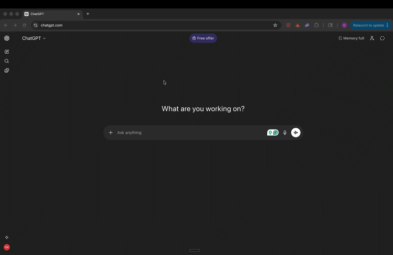

# FlowPrompt

**Store, search, and instantly paste your prompts from the macOS menu bar.**

[](https://github.com/kartikmehra/FlowPrompt/actions/workflows/build.yml)
[](LICENSE)
[]()



FlowPrompt is a lightweight macOS menu bar app for storing, organizing, and instantly pasting reusable text prompts into any text field. Hit a hotkey, search your prompts, press Enter -- it's pasted. Works great for AI prompts, code snippets, canned replies, templates, and anything you type repeatedly.

## Installation

### Homebrew (recommended)

```bash
brew tap kartikmehra/flowprompt
brew install --cask flowprompt
```

### Download

Grab the latest `.zip` from [Releases](https://github.com/kartikmehra/FlowPrompt/releases), unzip, and drag `FlowPrompt.app` to your Applications folder.

### Build from source

```bash
brew install xcodegen
git clone https://github.com/kartikmehra/FlowPrompt.git
cd FlowPrompt
xcodegen generate
xcodebuild -project FlowPrompt.xcodeproj -scheme FlowPrompt -configuration Release build
```

> **Note:** On first launch, macOS will ask you to grant Accessibility permission (**System Settings > Privacy & Security > Accessibility > FlowPrompt**). This is required for auto-paste and text capture.

## Features

- **Global hotkey launcher** (`Ctrl+Cmd+P`) -- Spotlight-style floating panel to search and paste prompts
- **Quick save** (`Ctrl+Cmd+S`) -- Capture selected text or clipboard as a new prompt in 3 seconds
- **Auto-paste** -- Selected prompt is pasted directly into the active text field (preserves clipboard)
- **Fuzzy search** -- Find prompts by title, content, tags, or category
- **Keyboard-first** -- Navigate everything with arrow keys, Enter, and Esc
- **Categories** -- Organize prompts into collapsible groups
- **Recently used** -- Quick access to your last 5 used prompts

## Keyboard Shortcuts

### Global (work from any app)

| Key | Action |
|---|---|
| `Ctrl+Cmd+P` | Open/close the launcher |
| `Ctrl+Cmd+S` | Quick save selected text as a prompt |

### Launcher Panel

| Key | Action |
|---|---|
| `↑/↓` | Navigate prompts and categories |
| `Enter` | Select and auto-paste |
| `Cmd+Enter` | Copy to clipboard only |
| `←/→` | Collapse/expand categories |
| `Esc` | Dismiss |
| `Cmd+N` | New prompt |
| `Cmd+E` | Edit selected prompt |
| `Cmd+Delete` | Delete selected prompt |
| Type anything | Fuzzy search |

## Storage

Prompts are stored as human-readable JSON at `~/.flowprompt/prompts.json`. Back it up, version-control it, or edit it by hand.

## Roadmap

- [ ] Import/export prompts (JSON, CSV)
- [ ] Prompt variables / template placeholders
- [ ] Sync across devices (iCloud or git-based)
- [ ] Prompt sharing via URL
- [ ] Customizable hotkeys

See the [open issues](https://github.com/kartikmehra/FlowPrompt/issues) for more ideas, and feel free to suggest your own.

## Contributing

Contributions are welcome! Please read the [Contributing Guide](CONTRIBUTING.md) to get started.

## License

[MIT](LICENSE)
